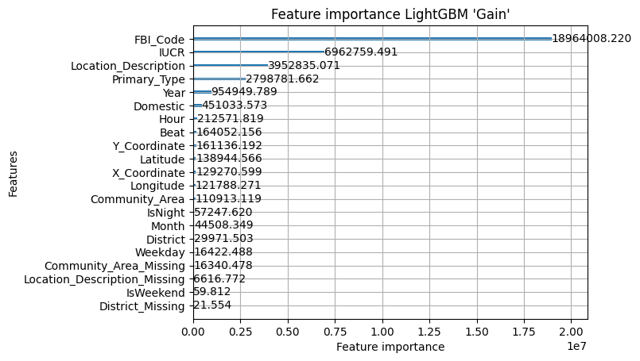
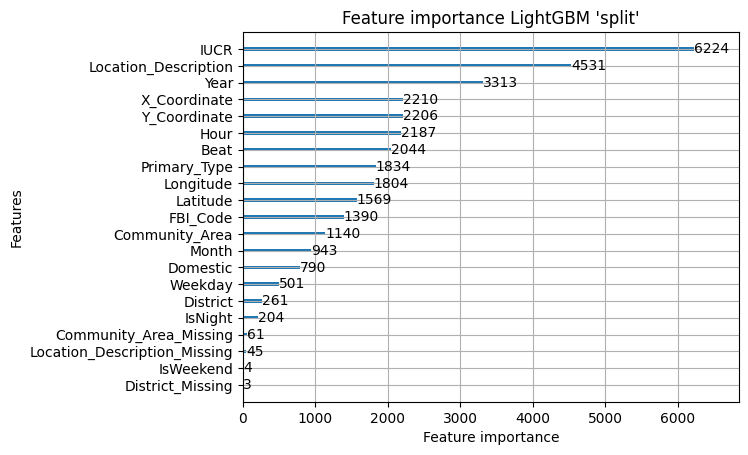
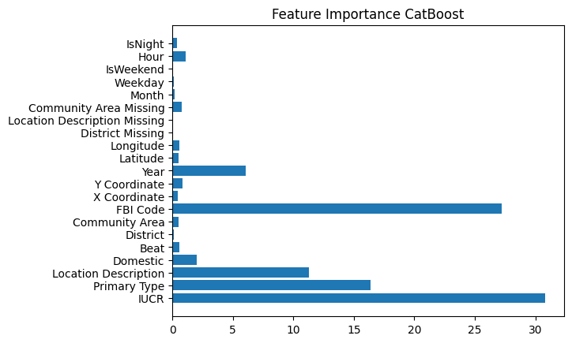
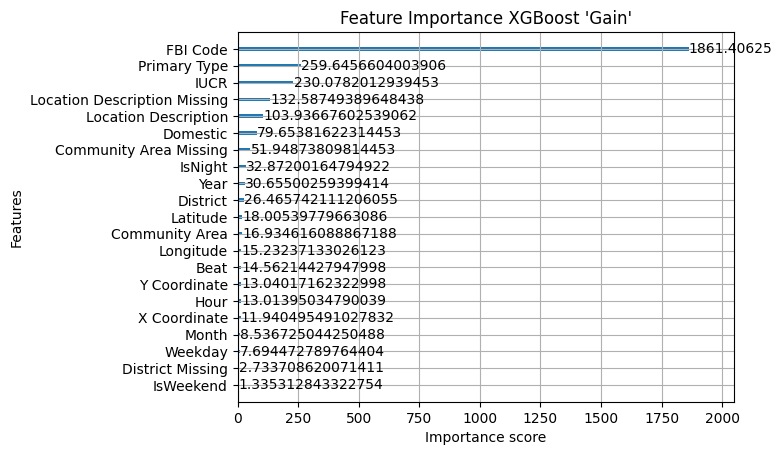

# Chicago Crime Prediction - Models Comparison

## Overview
This project evaluates multiple machine learning and deep learning models on the real-world dataset (Chicago crime rate dataset) and predicts if an arrest will happen.
The goal is to perform data preprocessing and then compare classical gradient boosting machine learning models (LightGBM, XGBoost, Catboost) with a custom MLP.
All the models are trained on the cleaned dataset `chicago_dataset_cleaned.csv`.

## Models
### LightGBM
- Uses RandomizedSearchCV
- Feature importance and results saved as:
    - `lightgbm_feature_importance_gain.png`
    - `lightgbm_feature_importance_split.png`
    - `lightgbm_results.csv`
### XGBoost
- Uses RandomizedSearchCV
- Uses `device = "cuda"` to run on GPU
- Feature importance and results saved as:
    - `xgboost_feature_importance.png`
    - `xgboost_results.csv`
### CatBoost
- Uses RandomizedSearchCV
- Uses `task_type = "GPU"`
- Feature importance and results saved as:
    - `catboost_results.csv`
    - `catboost_feature_importance.png`
### MLP(PyTorch)
- 5 Layers fully connected network
- BatchNorm + ReLU + Dropout
- Trained with:
    - BCEWithLogitsLoss
    - Adam
    - CosineAnnealingWarmRestarts
- Results saved as:
    - `mlp_results.csv`

## MLP Model Details
### Architecture:
- Input: 21 features
- Layers: 256 → 128 → 64 → 32 → 1
- Activation: ReLU
- Dropout (p = 0.2)
- Batch Normalization

### Training:
- Loss: `BCEWithLogitsLoss`
- Optimizer: Adam
- Learning rate: 0.001
- Weight decay: 0.0001
- Scheduler: CosineAnnealingWarmRestarts
- Epochs: 30
- Batch size: 524288
- Trained on GPU

## Dataset
The raw dataset includes more than 8 millions of rows and many issues. A full cleaning pipeline was applied before training the models.
- Source: [Chicago crime dataset](https://data.cityofchicago.org/Public-Safety/Crimes-2001-to-Present/ijzp-q8t2/about_data)
- Task: Binary Classification (`Arrest`)
- process:
    - Dropped columns with no useful information
    - Dealt with Null values
    - Extracted more data from certain columns
    - Converted data types
    - Checked the data in each column for correctness
    - Dealt with duplicate rows
    - Saved as a new `CSV` file

## Data Pipeline
- 80% Train / 20% Test
- Stratified split (preserve class ratio)
- Additional validation split for MLP mode
- With same `random_sate`, Same dataset splits used for all models

## Evaluation Metrics
- Accuracy
- Precision
- Recall
- F1 Score
- Training Time
- Inference Time

## Results
- Times are in second.
- For the full results please check the `csv` files in the `results` folder.

### LightGBM

|  Precision  |  Accuracy  |  Recall  |  F1  |  Random Search Time  |  Train Time  |  Inference Time|
|-------------|------------|----------|------|----------------------|--------------|--------------|
|   0.7069    |    0.8626  |   0.7651 |0.7349|         3703         |      75      |       9      |

#### Feature Importance (Gain):



#### Feature Importance (Split):



### CatBoost

|  Precision  |  Accuracy  |  Recall  |  F1  |  Random Search Time  |  Train Time  |  Inference Time|
|-------------|------------|----------|------|----------------------|--------------|--------------|
|   0.7034    |   0.8606   |   0.7605 |0.7308|         2143         |       60     |    0.75      |

#### Feature Importance:



### XGBoost

|  Precision  |  Accuracy  |  Recall  |  F1  |  Random Search Time  |  Train Time  |  Inference Time|
|-------------|------------|----------|------|----------------------|--------------|--------------|
|   0.7121    |   0.8647   |   0.7660 |0.7380|         1250         |       34     |    0.8      |

#### Feature Importance:



### MLP

|  Precision  |  Accuracy  |  Recall  |  F1  |  Train Time  |  Inference Time|
|-------------|------------|----------|------|--------------|--------------|
|   0.7032    |   0.8488   |   0.6789 |0.6909|       2818     |   208     |


## How to run
Requirements:
- pandas
- numpy
- scikit-learn
- lightgbm
- xgboost
- catboost
- torch
- matplotlib

```bash
python lightgbm_model.py
python catboost_model.py
python xgboost_model.py
python mlp_train.py
```

## Project Structure


## Conclusion
The project trained and evaluated three state-of-the-art gradient boosting models against a neural network (MLP) and a baseline classifier on a real-word dataset.
- **XGBoost** had the best overall performance, with the highest F1 score (0.738) and accuracy (0.865), making it the best model in this comparison.
- The performance of **LightGBM** and **CatBoost** were very close. Both slightly performed below XGBoost but still had strong results.
- The **MLP** underperformed compared to the other models. specially in recall and F1 score, confirming that neural networks are not always the best choice for tabular data.
- **XGBoost** had the fastest train time, making it the most efficient high-performing model overall.
- It


